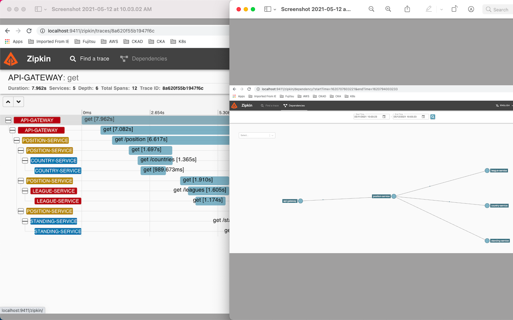

# What this APP does?
- User can find standings of a team playing league football match using country name, league name and team name. For Eg. country=England , league=Championship and team=Nottingham
- The app uses https://apifootball.com/documentation/ API to fetch country, league and standing to display them in the response.

## Key Features of the APP
- It uses Declarative REST Client: Feign to call services.
- Uses Eureka Service Registration and Discovery which enables client-side load-balancing and decouples service providers from consumers without the need for DNS.
- Application configuration are stored and fetched from Spring Cloud Config server for externalized configuration in a distributed system.
- Circuit Breaker and Retry implementation using Resilience4j lightweight fault tolerance library
- Disctributed tracing using Sleuth, Zipkin and RabbitMQ

## Architecture Diagram


#### Input
- Country : 'England'
- League  : 'Championship'
- Team    : 'Nottingham'

#### Output
```
	{
	    "Country ID & Name: ": "41 - England",
            "League ID & Name: ": "149 - Championship",
            "Team ID & Name: ": "2634 - Nottingham",
            "Overall League Position: ": "17"
	} 
```

###
The app has been dockerized. Docker images for individual microservices can be found at https://hub.docker.com/repositories/subhash06582

### How to Run App on LOCAL using DOKCER
```
1) git clone https://github.com/subhash06582/standing-api
2) cd standing-api
3) Go to indivudual folders (i.e. /config-server /country-service, /league-service, /naming-server /position-service /standing-service) and RUN './mvn clean install' to build *.jar' file
3) Return back to main folder (/standing-api)
4) Run 'docker-compose up' cmd. This will build docker images in a correct order from the docker-compose.yml file present at root.
```

### Ports

|     Application       |     Port          |
| ------------- | ------------- |
| Country Service | 8801, ...  |
| League Service | 8802, ... |
| Standing Service | 8803, ... |
| Netflix Eureka Naming Server | 8761 |
| Spring cloud config Server | 8888 |
| Position Service API | 8080 |
| Zipkin | 9411 |
| RAbbitMQ | 5672, 15672 |

### URLs

|     Application       |     URL          |
| ------------- | ------------- |
| Country Service - Indirect call from Position API| http://localhost:8801/api/countries/ |
| League Service - Indirect call from Position API| http://localhost:8802/api/leagues?countryId=41|
| Standing Service - Indirect call from Position API| http://localhost:8803/api/standings?leagueId=149|
| Position Service API - Direct call | http://localhost:8080/api/position?country=England&league=Championship&team=Nottingham|
| Spring cloud Config Server | http://localhost:8888/position-service/dev|
| Eureka Naming Server | http://localhost:8761/|
| Zipkin Tracing Server | http://localhost:9411/zipkin/|
| RabbitMQ Msg Broker | http://localhost:15672/|


### Health check Probes

|     Application       |    liveness  Probe          |     readiness  Probe          |
| ------------- | ------------- | ------------- |
| Country Service | http://localhost:8801/api/actuator/health/liveness | http://localhost:8801/api/actuator/health/readiness |
| League Service | http://localhost:8802/api/actuator/health/liveness| http://localhost:8802/api/actuator/health/readiness |
| Standing Service | http://localhost:8803/api/actuator/health/liveness| http://localhost:8803/api/actuator/health/readiness |
| Position Service | http://localhost:8080/api/actuator/health/liveness| http://localhost:8080/api/actuator/health/readiness |
| Config Server | http://localhost:8888/actuator/health/liveness| http://localhost:8888/actuator/health/readiness |
| Naming Server | http://localhost:8761/actuator/health/liveness| http://localhost:8761/actuator/health/readiness |

### More additions that could be done to the app
- [ ] Implementing Spring Cloud Gateway to provide a simple, yet effective way to route to APIs and provide cross cutting concerns to them such as: security, monitoring/metrics, and resiliency.
- [x] Distributed Tracing with Spring Cloud Sleuth and Spring Cloud Zipkin
      
- [x] Implementing, Circuit Breaker, Retry using Resilience4j spring-boot API
